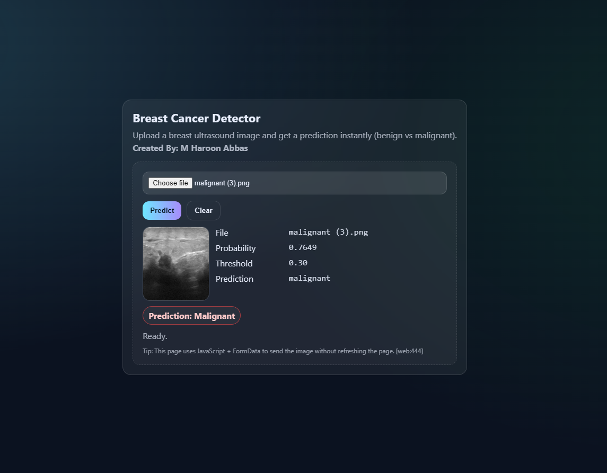

# Breast Cancer Classification System (Deep Learning)

Breast Cancer Classification System trained on the **BUSI** dataset to predict **normal / benign / malignant**, deployed as a FastAPI web app with a simple HTML/CSS/JS UI.

> Disclaimer: Educational project only. Not medical advice.

---



---

## Project structure
```md
```text
Breast-Cancer-Classifier/
  app.py
  models/
    final_efficientnetb0_3class.keras
  notebooks/
    Breast Cancer Classifier Notebook.ipynb
  templates/
    index.html
  requirements.txt
```

---

## Tech stack

### Training (Kaggle)
- Python, TensorFlow / Keras
- Transfer learning with EfficientNetB0
- Callbacks: EarlyStopping + ModelCheckpoint
- Input pipeline: `image_dataset_from_directory(...)` (folder-per-class format)

### Deployment (Local)
- FastAPI + Uvicorn
- Jinja2 template (HTML UI)
- JavaScript `fetch()` + `FormData` (no page reload)
- Pillow (PIL) for image decoding/resizing

FastAPI file upload uses `UploadFile = File(...)`. [web:766][web:770]  
Keras model is saved/loaded in the `.keras` format (whole model) using `model.save(...)` and `tf.keras.models.load_model(...)`. [web:585]

---

## Dataset

- Dataset: **BUSI (Breast Ultrasound Images Dataset)**
- Classes used in this project: `normal`, `benign`, `malignant`
- Notes:
  - BUSI includes segmentation masks (filenames containing `mask`)
  - For classification, we **exclude** mask images and train only on the raw ultrasound images

---

## Training workflow (Kaggle)

### 1) Prepare train/val/test splits
We copy the dataset into `/kaggle/working/` (writable) and build the folder-per-class structure that Keras expects.

Example:
```text
/kaggle/working/busi_processed_3class/
  train/
    normal/
    benign/
    malignant/
  val/
    normal/
    benign/
    malignant/
  test/
    normal/
    benign/
    malignant/
splits_3class.csv
```

### 2) Load datasets
We load with `tf.keras.utils.image_dataset_from_directory(...)` which infers labels from folder names. [web:766]

Common settings:
- `image_size=(224,224)` for EfficientNet input
- `shuffle=True` for train, `shuffle=False` for val/test
- `cache().prefetch(tf.data.AUTOTUNE)` for speed

### 3) Build model (Transfer Learning)
- Backbone: `tf.keras.applications.EfficientNetB0(include_top=False, weights="imagenet")`
- Head: GlobalAveragePooling → Dropout → Dense(3, softmax)
- Stage 1: freeze backbone and train only the classifier head (transfer learning workflow). [web:54]

### 4) Evaluate
Evaluation uses `model.evaluate(...)` and a confusion matrix + classification report (precision/recall/F1 per class).

---

## Final model (used in app)

- File: `models/final_efficientnetb0_3class.keras`
- Output: 3-class softmax probabilities: `normal`, `benign`, `malignant`
- Decision rule in the UI/API:
  - Default is argmax (top-1)
  - Optional **high-sensitivity mode**: if `prob_malignant >= T`, we force output to `"malignant"` to reduce malignant false negatives (trade-off: more false positives). [web:671][web:871]

---

## Local deployment (FastAPI)

### Endpoints
- `GET /` → HTML upload UI
- `POST /predict` → accepts image upload and returns JSON

FastAPI accepts uploaded images through `UploadFile` and reads bytes via `await file.read()`. [web:770]

### Prediction flow
1. Read uploaded image bytes
2. Convert to RGB and resize to `(224,224)` using Pillow
3. Convert to NumPy float array
4. Run `model.predict(...)` to get probabilities
5. Return JSON (`prediction`, `probs`, `prob_malignant`, optional forcing flags)

---

## Running locally

### 1) Install dependencies
```bash
pip install -r requirements.txt
```

### 2) Start the server
```bash
uvicorn app:app --reload --host 127.0.0.1 --port 8000
```

Open:
- http://127.0.0.1:8000 (UI)
- http://127.0.0.1:8000/docs (Swagger UI)

---

## How to test

### From UI
- Upload any ultrasound image
- UI displays:
  - probability of malignant
  - threshold (if high-sensitivity forcing is enabled)
  - final predicted label

### From terminal
```bash
curl -X POST "http://127.0.0.1:8000/predict" -F "file=@sample.png"
```

---

## Notes / limitations
- Dataset is relatively small; results depend on the split and preprocessing.
- Ultrasound images vary across machines/hospitals; performance may drop on external datasets.
- This is a demo classifier; real clinical systems require stronger validation and expert review.

---

## Next improvements (v2 ideas)
- Cross-validation for more stable evaluation
- Better augmentation tuned for ultrasound
- Probability calibration + more principled threshold selection
- Grad-CAM explainability (highlight regions contributing to predictions)
- Evaluate on external datasets (domain shift check)

---

## Author
Created by **M Haroon Abbas**  
GitHub: https://github.com/RealHaroon
---

## **Final note (model choice & deployment policy)**

We trained and tested multiple variants (baseline head-only vs fine-tuned + recall-focused thresholding). We ultimately kept the baseline model as the “final” model because it gave the best overall balance on the test set—higher accuracy and better weighted performance—while the high-recall setup increased malignant recall but caused a clear drop in overall accuracy due to more benign images being flagged as malignant (more false positives). In a general 3-class classification demo, that trade-off makes the model look worse to most users because the app appears to “overcall” malignant too often.

At the same time, we didn’t ignore the safety concern: in medical screening, missing malignant (false negatives) can be more costly than extra false alarms. That’s why the app includes a **high-sensitivity label** and an optional **forced malignant** rule: if the model’s malignant probability crosses a chosen threshold, we override the argmax decision and label the case as malignant (or at least mark it for review). This doesn’t change the model weights—it’s a deployment-time decision policy—so you can keep the baseline model for overall performance while still offering a “safer mode” when your priority is catching more malignant-like cases.
```
```
---
